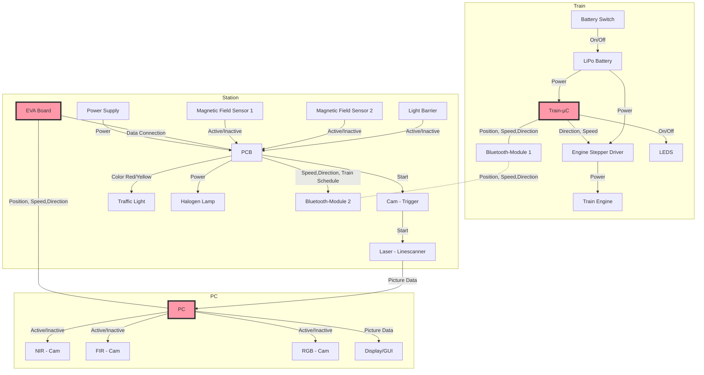

# Hardware Documentation

The following document describes the **Components and their Interactions**  before and after the Redesign of the Multicamera-Demonstrator to an Arduino-based Project. It's primarily meant as a guideline to enable the Development team **to implement cohesive and decoupled functions** for optimal code readability, reusability and debugging.

## Components before Redesign
### Photographic Overview
[Placeholder]
### Component Signal Flowchart

Block Diagrams marked red are programmable and topic of the [Software Documentation](https://gitlab.tu-ilmenau.de/FakMB/QBV/systems/legocity/legocity/tree/master/Software%20Documentation).

### Component List and Description (w\ Links)
#### Train
The Railcar housing these Components can be found under [3D-CAD Files](https://gitlab.tu-ilmenau.de/FakMB/QBV/systems/legocity/railroad-engine-3d-cad.git).

| Name  | Component | Description |
| ------------- | ------------- | ------------- |
| Train-µC  | ATmega168PA  | [ATmega168PA µC](Datasheets/ATmega168PA_Datasheet.pdf)|
| Engine Stepper Driver  | POLOLU MD09B Stepper Driver  | [Stepper Driver](Datasheets/Pololu_Driver.pdf)  |
| Train Engine  | -  | -  |
| Bluetooth-Module 1  | Bluetooth-RN42-I/RM  | [Bluetoothmodule](Datasheets/RN42.pdf)  |
| LiPo Battery  | -  | Jamara LiPo 25C 7,4V regulated with [Voltage Regulator](Datasheets/lm2937.pdf) and charged with LiPo 25 balancer PHQ-CPU7V4    |

#### Station

| Name  | Component | Description |
| ------------- | ------------- | ------------- |
| Power Supply  | -  | [Line Voltage to 12V](Datasheets/Powersupply_POS-60-spec_PL_NL.pdf) |
| EVA Board  | Atmel Eva-Board 2.01 with ATmega644P  | [Eva-Board](Datasheets/Atmel_Eva_Board.pdf) and [µC](ATmega644P)  |
| PCB  | -  |Photos of the [PCB](PCB%20Layout) , [Wiring](Wiring) and [Eagle Schematics](https://gitlab.tu-ilmenau.de/FakMB/QBV/systems/legocity/pcb-designs.git)  |
| Cam - Trigger  | -  | -  |
| LiPo Battery  | -  | -  |
| Laser - Linescanner  | -  | -  |
| Traffic Light  | -  | -  |
| Magnetic Field Sensor 1&2  | -  | -  |
| Halogen Lamp  | -  | 12V  |
| Light Barrier  | -  | -  |
| Bluetooth-Module 2  | Bluetooth-RN42-I/RM  | [Bluetoothmodule](Datasheets/RN42.pdf)  |

#### PC
| Name  | Component | Description |
| ------------- | ------------- | ------------- |
| PC  | -  | -  |
| NIR - Cam  | -  | -  |
| FIR - Cam  | -  | -  |
| RGB - Cam  | -  | -  |
| Display/GUI  | -  | Implemented in MatLab  |

### Pin Requirements for the Redesign

Two prime Candidates for the station and train µC-Boards  are the [Arduino Nano33 IOT](https://store.arduino.cc/nano-33-iot) and the [Arduino Nano v3.0](https://store.arduino.cc/arduino-nano).  While the Nano33 offers the same Pins and Size as the Nano, the Nano33 comes with a built-in Bluetooth Module. It does, however, only work with an operating Voltage of 3.3V (instead of 3.3V and 5V like the Nano).

Therefore, it has to be checked if the available Pins are sufficient and if the possible additional work of regulating existing components down to 3.3V outweighs the benefit of inherent Bluetooth capability.

## Components after Redesign
### Photographic Overview
[Placeholder]