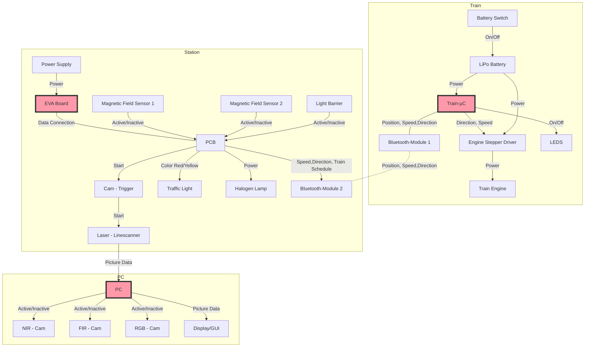

# Hardware Documentation

The following document describes the **Components and their Interactions**  before and after the Redesign of the Multicamera-Demonstrator to an Arduino-based Project. It's primarily meant as a guideline to enable the Development team **to implement cohesive and decoupled functions** for optimal code readability, reusability and debugging.

## Components before Redesign
### Photographic Overview
[Placeholder]
### Component Signal Flowchart

Block Diagrams marked red are programmable and topic of the [Software Documentation](https://gitlab.tu-ilmenau.de/FakMB/QBV/systems/legocity/legocity/tree/master/Software%20Documentation).

### Component List and Description (w\ Links)
#### Train
The Railcar housing these Components can be found under [3D-CAD Files](https://gitlab.tu-ilmenau.de/FakMB/QBV/systems/legocity/railroad-engine-3d-cad.git).

| Name  | Component | Description |
| ------------- | ------------- | ------------- |
| Train-µC  | ATmega168PA  | [ATmega168PA µC](Datasheets/ATmega168PA_Datasheet.pdf)|
| Engine Stepper Driver  | POLOLU MD09B Stepper Driver  | -  |
| Train Engine  | -  | -  |
| Bluetooth-Module 1  | Bluetooth-RN42-I/RM  | -  |
| LiPo Battery  | -  | 10V, regulated down with    |

#### Station

| Name  | Component | Description |
| ------------- | ------------- | ------------- |
| Power Supply  | -  | Line Voltage to 12V  |
| EVA Board  | Atmel Eva-Board 2.01 with ATmega644P  | -  |
| PCB  | -  | -  |
| Cam - Trigger  | -  | -  |
| LiPo Battery  | -  | -  |
| Laser - Linescanner  | -  | -  |
| Traffic Light  | -  | -  |
| Magnetic Field Sensor 1&2  | -  | -  |
| Halogen Lamp  | -  | 12V  |
| Light Barrier  | -  | -  |
| Bluetooth-Module 2  | Bluetooth-RN42-I/RM  | -  |

#### PC
| Name  | Component | Description |
| ------------- | ------------- | ------------- |
| PC  | -  | -  |
| NIR - Cam  | -  | -  |
| FIR - Cam  | -  | -  |
| RGB - Cam  | -  | -  |
| Display/GUI  | -  | Implemented in MatLab  |

### Current Pinout and Pin Requirements for the Redesign
[Placeholder]
## Components after Redesign
### Photographic Overview
[Placeholder]