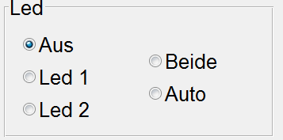
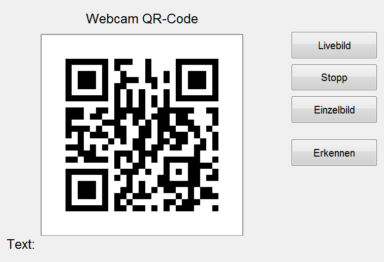
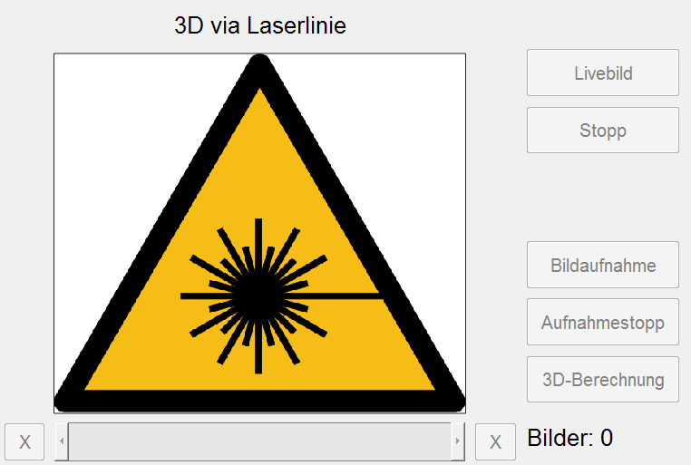
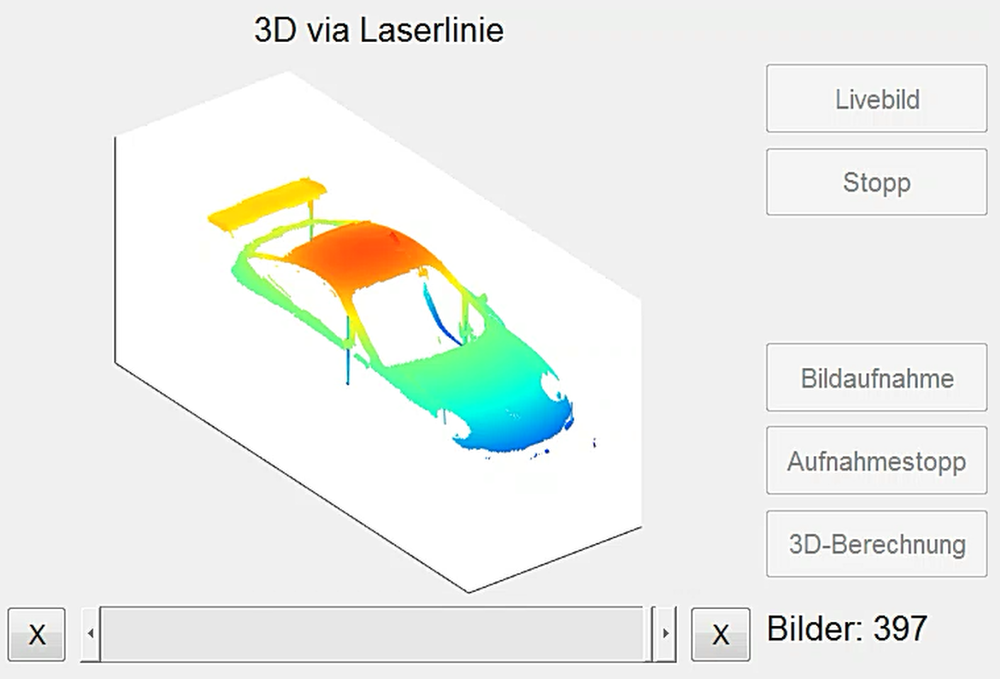
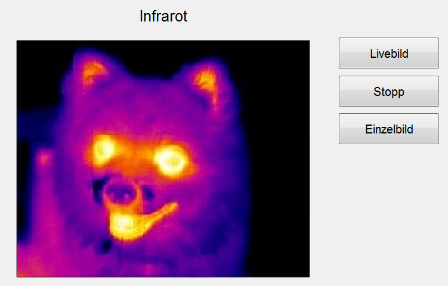
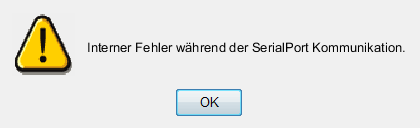

# End-User Document

  
Es handelt sich um einen Demonstratoraufbau, der verschiedene Messverfahren zur Qualitätskontrolle mittels Bildverarbeitung zeigt.  
Der Demonstrator verfügt über einen Demo-Modus und einen manuellen Modus.

## GUI Übersicht

Es ist eine von **Matlab Guide** erstellte Benutzeroberfläche zur Steuerung des Systems.  
Die Schnittstelle kann in vier Abschnitte unterteilt werden:

- Abschnitt initialisieren **Teil 1** mit zwei Tasten
  - **COM-Port verbinden**
  - **Kameras initialisieren**
- Kontrollabschnitt **Teil 2**, der besteht aus:
  - **Akku Etikett**
  - **Eisenbahn Panel**
  - **LED Panel**
  - **Halogenlampe Panel**
- Kamerabereich **Teil 3** und besteht aus:
  - **Webcam QR-Code Abschnitt**
  - **3D über Laserlinie** Schnitt
  - **Abschnitt Multispektral Abschnitt**
  - **Infrarot** Abschnitt
- **Demo-Modus** Taste

## Programm Initialisieren

Wenn das System zum ersten Mal eingeschaltet wird, muss es initialisiert werden, damit es ordnungsgemäß funktioniert. Dieser Prozess wird wie folgt durchgeführt:

### COM Ports

Wenn Sie **COM-Port verbinden-Taste** drücken, um die Kommunikation über die serielle Schnittstelle zu starten, dauert es eine Weile, bis die Tasten in **Teil 2** aktiviert und betriebsbereit sind. Es kann ein kleiner Test durchgeführt werden, um sicherzustellen, dass das System angeschlossen ist, z.B.: Änderung der Geschwindigkeit des Zuges und Überprüfung, ob er sich bewegt.  
**Hinweis: Die Bahn muss eingeschaltet sein, um die Verbindung herzustellen.**

### Kameras

Nach dem Drücken von **Kameras initialisieren-Taste** ~~und Während des Wartens auf die Verbindung von den Kameras~~ werden die Tasten in **Teil 3** nach einer erfolgreichen Verbindung aktiviert. Die Initialisierung der Kameras dauert zum ersten Mal ungefähr **30 Sekunden**.  
Nach dieser beiden Schritten ist das Programm bereit und kann gestartet werden. Die oben genannten Schaltflächen befinden sich auf der rechten oberen Seite der Benutzeroberfläche (**Teil 1**).

Die **Initialisierung** muss immer beim Start im Manual- und im Demo-Modus ausgeführt werden.
Der Abschnitt **Steuerungen** kann im manuellen Modus live genutzt werden, ist aber im Demo-Modus völlig passiv. Die Voreinstellungen für die **LED** und die **Halogenlampe** bleiben im Demo-Modus gültig. Die Einstellungen für die **Bahn** werden ignoriert.
Wenn die **LEDs** oder die **Halogenlampe** auf Auto eingestellt sind, werden sie nur während der Aufnahme der Fotos eingeschaltet. (die "Led" für QR-Code, die "Halogenlampe" für das Multispektralbild).  
**HINWEIS: Der Kontakt der Halogenlampe ist nicht stabil.** 
Der Bereich **Kameras** kann im manuellen Modus live genutzt werden, ist aber im Demo-Modus vollständig passiv. Die Daten werden angezeigt, obwohl die Tasten nicht gedrückt werden können.
Mit der Schaltfläche **Demo-Mode** wird der Demo-Modus aktiviert / deaktiviert.

### Manual Modus

In diesem Teil werden die Funktionen des Programms manuell gesteuert.

### Kontrollen

#### Akku

Zeigt den Ladezustand der Batterie in cV an, z.B.: 779, das bedeutet 7,79 Volt.

Ohne Verbindung zum **COM-Port** wird die Spannung der Batterie nicht angezeigt. Das kann auch passieren, wenn der Zug nicht **angeschaltet** ist.

#### Eisenbahn

Dieser Teil hilft dabei, den Zug manuell zu steuern, die Fahrtrichtung entweder nach **links** oder nach **rechts** zu bestimmen und die **Geschwindigkeit** über einen Schieberegler zu ändern.

| Taste               | Funktion                               |
| ------------------- | -------------------------------------- |
| **Links**           | Bewegungsrichtung nach Links auswählen |
| **Rchts**           | Bewegungsrichtung nach Rechts auswälen |
| **Geschwindigkeit** | Zugsgeschwindigkeit von 0 -- 9         |

#### Leds

Weil die Raumbeleuchtung nicht ausreicht, um die einwandfreie Funktion der **QR-Code Webcam** zu gewährleisten, sind einige Optionen zur Verfügung, damit die Beleuchtung verbessert werden kann.
**HINWEIS: Die LEDs haben keinen Einfluss auf die Multispektralkamera (Nahinfrarot), da sie nur sichtbares Licht ausstrahlen.**

| Taste     | Funktion                                     |
| --------- | -------------------------------------------- |
| **Led 1** | Led 1 anschalten                             |
| **Led 2** | Led 2 anschalten                             |
| **Beide** | Led 1 und Led 2 zusammen anschalten          |
| **Auto**  | die beiden Leds werden automatisch aktiviert |
| **Aus**   | die beiden Leds ausschalten                  |

**Hinweiß zum auto-button**:  
Im Demo-Modus leuchten die LEDs nur während der Aufnahme des QR-Codes.

### **Halogenlampe**

Die **Multispektralkamera** setzt spezielle _Lichtbedingungen_ voraus (Infrarotstrahler), damit sie richtig funktioniert und wertvolle nutzbare Bilder gewährleistet. Deswegen wurde eine **Halogenlampe** am Projekt hinzugefügt. Diese Lampe konnte einfach durch die folgenden Fläche bedient werden.

| Taste    | Funktion                                       |
| -------- | ---------------------------------------------- |
| **Aus**  | Lampe ausschalten                              |
| **An**   | Lampe anschalten                               |
| **Auto** | Lampe wird automatisch ein- oder ausgeschaltet |

**Hinweiß zum auto-button**:  
Im Demo-Modus leuchtet die Lampe nur, wenn die Multispektralkamera das Bild aufnimmt.

### Kameras

Dieses System hat vier Kameras:

#### Webcam QR-Code

Diese Kamera wird verwendet, um einen QR-Code zu erkennen, der sich auf einem Zugwagen befindet.

| Taste          | Funktion                                                                    |
| -------------- | --------------------------------------------------------------------------- |
| **Livebild**   | Liveview von der Kamera auf dem Bildschirm anzeigen                         |
| **Stopp**      | Liveview ausschalten                                                        |
| **Einzelbild** | Bild aufnehmen und auf dem Bildschirm anzeigen                              |
| **Erkennen**   | Erkennen des QR-Codes im Bild und Anzeigen einer Meldung auf dem Bildschirm |

Wenn der QR-Code erkannt wird, erscheint neben dem Wort **Text** eine grüne Meldung, wie in der folgenden Abbildung dargestellt.

Wenn der Zug zu schnell fährt, kann der QR-Code nicht erkannt werden. Die Meldung wird rot und lautet **nichts erkannt**.

#### 3D über Laserlinie

Mit Hilfe einer Laserlinie wird das Objekt, das sich auf einem Zugwagen befindet, gescannt. Nach dem Scannen wird ein 3D-Foto auf dem Bildschirm angezeigt, das über den Touchscreen um 360 Grad gedreht werden kann.

| Taste             | Funktion                                            |
| ----------------- | --------------------------------------------------- |
| **Livebild**      | Liveview von der Kamera auf dem Bildschirm anzeigen |
| **Stopp**         | Liveview ausschalten                                |
| **Bildaufnahme**  | Fotosaufnehmen beginnen                             |
| **Aufnahmestopp** | Fotosaufnehmen stoppen                              |
| **3D-Berechnung** | Berechnung des 3D-Bildes                            |

Hier ist ein Bild, das den Scanvorgang und das endgültige 3D-Bild zeigt.

|          Aufnehmen          |           3D-Bild            |
| :-------------------------: | :--------------------------: |
|  |  |

Um einen 3D-Scan manuell zu starten, müssen diese Schritte durchgeführt werden:

1. Klicken Sie auf die Schaltfläche **Bildaufnahme**.
2. Lassen Sie den Zug mit konstanter Geschwindigkeit durch die Lichtschranke fahren.
3. Klicken Sie auf die Schaltfläche **Aufnahmestopp**.
4. Klicken Sie auf die Schaltfläche **3D-Berechnung**.

Wenn die aufgenommenen Fotos nicht ausreichen, um ein 3D-Modell zu berechnen, wird eine Fehlermeldung auf dem Bildschirm angezeigt.

**Hier ist eine Vorschau auf den Arbeitsablauf der 3D-Laserkamera.**

#### Multispektralkamera

Diese Kamera verwendet die Halogenlampe, um ein Infrarotbild, die im nahen der Infrarotbereich ist, aufzunehmen.

| Taste          | Funktion                                                 |
| -------------- | -------------------------------------------------------- |
| **Livebild**   | Liveview von der Kamera auf dem Bildschirm anzeigen      |
| **Stopp**      | Liveview ausschalten                                     |
| **Einzelbild** | einziles Bild aufnehmen und es auf dem Bildschirm zeigen |

Hier sind zwei Bilder von einem 100-Euro-Schein, wie er bei normalem Licht aussieht und wie er mit der Multispektralkamera aussieht:

|        Normal (RGB-Bild)        |        Multispektral (Nah-Infrarot-Foto)        |
| :-----------------------------: | :---------------------------------------------: |
|  |  |

**HINWEIS: Diese Kamera benötigt viel Licht. Daher muss die Halogenlampe eingeschaltet sein, um das Objekt zu sehen. Die LEDs beeinflussen diese Kamera nicht, da sie kein Infrarotlicht aussenden.**

#### Infrarot

Die einzige Funktion dieser Kamera besteht darin, ein Livebild auf dem Bildschirm anzuzeigen.

| Taste          | Funktion                                                 |
| -------------- | -------------------------------------------------------- |
| **Livebild**   | Liveview von der Kamera auf dem Bildschirm anzeigen      |
| **Stopp**      | Liveview ausschalten                                     |
| **Einzelbild** | einziles Bild aufnehmen und es auf dem Bildschirm zeigen |

Hier ist eine Live-Ansicht der Infrarotkamera.

## Demo-Modus

Das Hauptziel von **Demo Mode** ist es, verschiedene Messverfahren vollautomatisch und ohne Bediener durchzuführen. Dieser Modus wird in Ausstellungen und Showrooms verwendet.

### Demo-Modus-Taste

Nach der Initialisierung des Programms, wie im Abschnitt [**Programm Initialisieren**](https://gitlab.tu-ilmenau.de/FakMB/QBV/systems/legocity/legocity/blob/master/gui/doc/end-doc.md#programm-initialisieren), kann die Taste Demo-Modus gedrückt werden. Im Demo-Modus fährt der Zug immer auf einer Kreisbahn. In der ersten Runde fährt der Zug langsam bis zum Bahnhof, so dass sich ein schwarzes Kunststoffstück entlang einer Fotozelle bewegen kann, und aktiviert die Laserlinie, die das Objekt auf dem Zugwagen (dem Wagen) abtastet. In der zweiten Runde verlangsamt sich der Zug, wenn er den Bahnhof erreicht, die Ampel wird rot, dann hält der Zug an, so dass der QR-Code (auf einem Wagen) unter der Webcam positioniert wird und das zweite Objekt (Fahrtiecket) unter der Multispektralkamera steht, zwei Fotos werden in dieser Runde aufgenommen, ein QR-Code Foto und ein Multispektralfoto.

Diese Schritte werden wiederholt, bis die Taste Demo-Modus erneut gedrückt wird.  
Wenn die Taste **Demo Modus** vor der Taste **Kamerasinitialisieren** gedrückt wird, erscheint eine Meldung **Fehler** auf dem Bildschirm.

