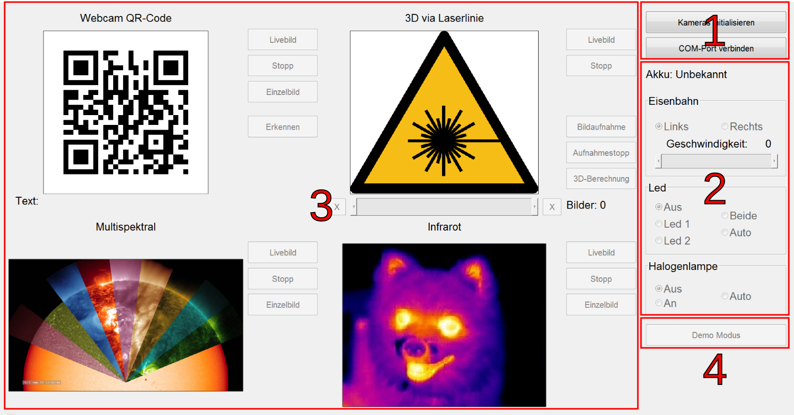

# End-User Document

  
Es handelt sich um einen Demonstratoraufbau, der verschiedene Messverfahren zur Qualitätskontrolle mittels Bildverarbeitung zeigt.  
Der Demonstrator verfügt über einen Demo-Modus und einen manuellen Modus.

## GUI Übersicht

Es ist eine von **Matlab Guide** erstellte Benutzeroberfläche zur Steuerung des Systems.  
Die Schnittstelle kann in vier Abschnitte unterteilt werden:

- Abschnitt initialisieren **Teil 1** mit zwei Tasten
  - **COM-Port verbinden**
  - **Kameras initialisieren**
- Kontrollabschnitt **Teil 2**, der besteht aus:
  - **Akku Etikett**
  - **Eisenbahn Panel**
  - **LED Panel**
  - **Halogenlampe Panel**
- Kamerabereich **Teil 3** und besteht aus:
  - **Webcam QR-Code Abschnitt**
  - **3D über Laserlinie** Schnitt
  - **Abschnitt Multispektral Abschnitt**
  - **Infrarot** Abschnitt
- **Demo-Modus** Taste

## Programm Initialisieren

Wenn das System zum ersten Mal eingeschaltet wird, muss es initialisiert werden, damit es ordnungsgemäß funktioniert. Dieser Prozess wird wie folgt durchgeführt:

### COM Ports

Wenn Sie **COM-Port verbinden-Taste** drücken, um die Kommunikation über die serielle Schnittstelle zu starten, dauert es eine Weile, bis die Tasten in **Teil 2** aktiviert und betriebsbereit sind. Es kann ein kleiner Test durchgeführt werden, um sicherzustellen, dass das System angeschlossen ist, z.B.: Änderung der Geschwindigkeit des Zuges und Überprüfung, ob er sich bewegt.  
**Hinweis: Die Bahn muss eingeschaltet sein, um die Verbindung herzustellen.**

### Kameras

Nach dem Drücken von **Kameras initialisieren-Taste** ~~und Während des Wartens auf die Verbindung von den Kameras~~ werden die Tasten in **Teil 3** nach einer erfolgreichen Verbindung aktiviert. Die Initialisierung der Kameras dauert zum ersten Mal ungefähr **30 Sekunden**.  
Nach dieser beiden Schritten ist das Programm bereit und kann gestartet werden. Die oben genannten Schaltflächen befinden sich auf der rechten oberen Seite der Benutzeroberfläche (**Teil 1**).

Die **Initialisierung** muss immer beim Start im Manual- und im Demo-Modus ausgeführt werden.
Der Abschnitt **Steuerungen** kann im manuellen Modus live genutzt werden, ist aber im Demo-Modus völlig passiv. Die Voreinstellungen für die **LED** und die **Halogenlampe** bleiben im Demo-Modus gültig. Die Einstellungen für die **Bahn** werden ignoriert.
Wenn die **LEDs** oder die **Halogenlampe** auf Auto eingestellt sind, werden sie nur während der Aufnahme der Fotos eingeschaltet. (die "Led" für QR-Code, die "Halogenlampe" für das Multispektralbild).  
**HINWEIS: Der Kontakt der Halogenlampe ist nicht stabil.** 
Der Bereich **Kameras** kann im manuellen Modus live genutzt werden, ist aber im Demo-Modus vollständig passiv. Die Daten werden angezeigt, obwohl die Tasten nicht gedrückt werden können.
Mit der Schaltfläche **Demo-Mode** wird der Demo-Modus aktiviert / deaktiviert.

### Manual Modus

In diesem Teil werden die Funktionen des Programms manuell gesteuert.

### Kontrollen

#### Akku

Zeigt den Ladezustand der Batterie in cV an, z.B.: 779, das bedeutet 7,79 Volt.

Ohne Verbindung zum **COM-Port** wird die Spannung der Batterie nicht angezeigt. Das kann auch passieren, wenn der Zug nicht **angeschaltet** ist.

#### Eisenbahn

Dieser Teil hilft dabei, den Zug manuell zu steuern, die Fahrtrichtung entweder nach **links** oder nach **rechts** zu bestimmen und die **Geschwindigkeit** über einen Schieberegler zu ändern.

| Taste               | Funktion                               |
| ------------------- | -------------------------------------- |
| **Links**           | Bewegungsrichtung nach Links auswählen |
| **Rchts**           | Bewegungsrichtung nach Rechts auswälen |
| **Geschwindigkeit** | Zugsgeschwindigkeit von 0 -- 9         |

#### Leds

Weil die Raumbeleuchtung nicht ausreicht, um die einwandfreie Funktion der **QR-Code Webcam** zu gewährleisten, sind einige Optionen zur Verfügung, damit die Beleuchtung verbessert werden kann.
**HINWEIS: Die LEDs haben keinen Einfluss auf die Multispektralkamera (Nahinfrarot), da sie nur sichtbares Licht ausstrahlen.**

| Taste     | Funktion                                     |
| --------- | -------------------------------------------- |
| **Led 1** | Led 1 anschalten                             |
| **Led 2** | Led 2 anschalten                             |
| **Beide** | Led 1 und Led 2 zusammen anschalten          |
| **Auto**  | die beiden Leds werden automatisch aktiviert |
| **Aus**   | die beiden Leds ausschalten                  |

<a style="color:#4527a0">
Auto: Im Demo-Modus leuchten die LEDs nur während der Aufnahme des QR-Codes.
</a>

### **Halogenlampe**

---

Die **Multispektralkamera** setzt spezielle _Lichtbedingungen_ voraus, damit sie richtig funktioniert und wertvolle nutzbare Bilder gewährleistet. Deswegen wurde eine **Halogenlampe** am Projekt hinzugefügt. Diese Lampe konnte einfach durch die folgenden Fläche bedient werden.  
Im Auto :`Die Kamera wird nur eingeschaltet, wenn der Wagen in der richtigen Position ist`

| Taste    | Funktion                                       |
| -------- | ---------------------------------------------- |
| **Aus**  | Lampe ausschalten `von Anfang`                 |
| **An**   | Lampe anschalten `von Anfang`                  |
| **Auto** | Lampe wird automatisch ein- oder ausgeschaltet |

### **Demo Modus Taste**

---

Nachdem das Programm initialisiert wurde -wie im Abschnitt [**Programm Initialisieren**](https://gitlab.tu-ilmenau.de/FakMB/QBV/systems/legocity/legocity/blob/master/gui/doc/end-doc.md#programm-initialisieren)-, kann man die **Demo Modus** Taste drücken.

Im **Demo-Modus** fährt der Zug immer auf einer Kreisbahn. In der ersten Runde wird das Objekt auf dem Zugwagen (das Auto) mit einem **3D-Laserscanner** gescannt. In der zweiten Runde wird ein Foto des **QR-Codes** aufgenommen, gescannt und erkannt, und es wird auch ein **multispektrales** Foto aufgenommen.

# **Manuell-Modus**

In diesem Teil werden die Funktionen des Programms manuell gesteuert, das System muss jedoch zuvor initialisiert werden.

## **Steuerteil 2**

### **Webcam QR-Code**

Diese Kamera wird verwendet, um einen QR-Code zu erkennen, der sich in einem Zugwagen befindet.

  
 
[Abb 9](images/QR1.PNG) "Webcam QR-Code"
"

| Taste          | Funktion                                                                    |
| -------------- | --------------------------------------------------------------------------- |
| **Livebild**   | Kamera einschalten und das Filmmaterial auf dem Bildschirm anzeigen         |
| **Stopp**      | Kamera ausschalten                                                          |
| **Einzelbild** | Bild aufnehmen und auf dem Bildschirm anzeigen                              |
| **Erkennen**   | Erkennen des QR-Codes im Bild und Anzeigen einer Meldung auf dem Bildschirm |

Wenn der Zug den Bahnhof erreicht, fährt er langsam und hält dann an, so dass der QR-Code direkt unter der zu erkennenden Webcam positioniert wird. Wenn der QR-Code erkannt wird, wird neben dem Wort Text eine grüne Meldung angezeigt (siehe Abbildung 10)

  
 
[Abb 10](images/QRerkennen.PNG) "QR-Code erkannt"

Wenn der Zug zu schnell fährt, wird der QR-Code nicht erkannt. Die Meldung wird rot und zeigt `Nichts erkannt` an (Abbildung 11).

 
 
[Abb 11](images/notdetected.PNG) "QR-Code nicht erkannt"

---

## **3D via Laserlinie**

Mit Hilfe einer Laserlinie wird das Objekt, das sich auf einem Zugwagen befindet, gescannt. Nach dem Scannen wird ein 3D-Foto auf dem Bildschirm angezeigt, das über den Touchscreen um 360 Grad gedreht werden kann.

[Abb 12](images/3d.png) "3D via Laserlinie"

| Taste             | Funktion                                                            |
| ----------------- | ------------------------------------------------------------------- |
| **Livebild**      | Kamera einschalten und das Filmmaterial auf dem Bildschirm anzeigen |
| **Stopp**         | Kamera ausschalten                                                  |
| **Bildaufnahme**  | Bilder aufnehmen                                                    |
| **Aufnahmestopp** | der Aufnahmeprozess beenden                                         |
| **3D-Berechnung** | Berechnung der aufgenommenen Bilder in einem 3D-Bild                |

Hier ist ein Bild, das den Scan und das endgültige 3D-Bild zeigt.

|           Scannen           |        3D-Bild         |
| :-------------------------: | :--------------------: |
|  |  |

[Abb 13](images/scanning3d2.PNG) "Scanprozess"

**Hier ist eine vollständige Vorschau des Arbeitsablaufs für die 3D-Laserkamera**

Wenn die aufgenommenen Bilder nicht ausreichen, um ein 3D-Modell zu berechnen, wird eine Fehlermeldung auf dem Bildschirm angezeigt.

[Abb 14](images/Error3D.PNG) "3D Fehler"

## **Multispektral**

Diese Kamera verwendet die Halogenlampe, um ein Infrarotbild im nahen Infrarotbereich aufzunehmen.

[Abb 15](images/Multispektral.PNG) "Multispektral"

| Taste          | Funktion                                                            |
| -------------- | ------------------------------------------------------------------- |
| **Livebild**   | Kamera einschalten und das Filmmaterial auf dem Bildschirm anzeigen |
| **Stopp**      | Kamera ausschalten                                                  |
| **Einzelbild** | Bild aufnehmen und auf dem Bildschirm anzeigen                      |

## **Infrarot**

Die einzige Funktion dieser Kamera ist, ein Livebild auf dem Bildschirm anzuzeigen.

[Abb 16](images/Infrarot.PNG) "Infrarot"

| Taste          | Funktion                                                            |
| -------------- | ------------------------------------------------------------------- |
| **Livebild**   | Kamera einschalten und das Filmmaterial auf dem Bildschirm anzeigen |
| **Stopp**      | Kamera ausschalten                                                  |
| **Einzelbild** | Bild aufnehmen und auf dem Bildschirm anzeigen                      |
