# End-User Document 

It is a demonstrator setup showing various measurement techniques used in quality control using image processing.

The demonstrator has a demo mode and a manual mode.
## GUI overview
It is user interface created by **Matlab Guide** to controll the system.

The interface can be divided into four sections:
- Initialize Section **Part 1** which has two buttons
    - **Kameras initialisieren**
    - **COM-Port verbinden**
- Controls section **Part 2** which consists of:
    - **Akku** Label
    - **Eisenbahn** Panel
    - **Led** Panel
    - **Halogenlampe** Panel
- Cameras section **Part 3** and consists of:
    - **Webcam QR-Code** Section
    - **3D via Laserlinie** Section
    - **Multispektral** Section
    - **Infrarot** Section
- **Demo Mode** Button

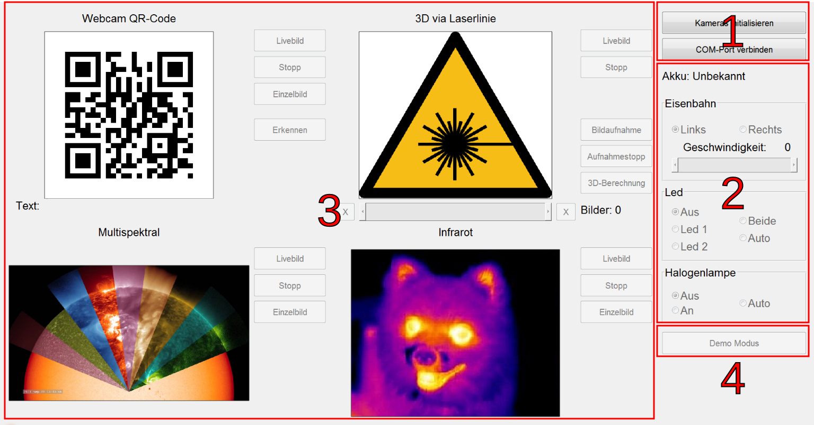

## Initialize

 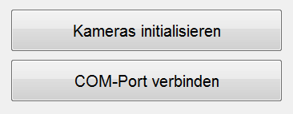

When the system is first turned on, it must be initialized for it to work properly. This process is performed as follows:

### Cameras
Pressing **COM-Port verbinden** to start the communication via the serial port, then the system takes a while untill the keys in **Part 2** are activated and ready for use. A small test can be made to ensure that the system is connected, for exaple: changing the speed of the train and checking if its going to move. 
**Note: The railway must be switched on to start the connection.**

### COM-Port
Pressing **Kameras initialisieren** and waiting for the cameras to connect ,the buttons in **Part 3** will be activated after a sucessful connection. The initialization of the cameras takes a very long time for the first time since they are activated one after the other.

After completing these two steps, the program is ready and can be started. The buttons mentioned above are located on the upper right side of the user interface (**Part 1**).

The **Initialize** must always be executed at startup in Manual- and in Demo-Mode.
The **Controls** section can be used live in manual mode, but is completly passive in the demo mode. The preset for the **LED** and the **Halogen Lamp** remain valid during the Demo-Mode. The settings for the **Railway** will be ignored.
If the **LEDs** or the **Halogen Lamp** are set to Auto, they will be turned on only while the photos are being taken. (the "Led" for QR code, the "Halogen Lamp" for the multispectral photo).  
**NOTE: The contact of the halogen lamp is not stable.** 
The **Cameras** section can be used live in manual mode, but in the demo mode it is completely passive. The data is displayed even though the buttons can not be pressed.
The **Demo-Mode** button activates / deactivates the demo mode.

## Manual Mode
In this Part the functions of the programm will be controlled manually.

### Controls 
#### Battery

Shows the level of the battery in cV, for example: 779 that means 7.79 Volt.

Before pressing the **COM-Port verbinden** button, the voltage of the battery will not be shown, also it will not be shown if the train is not connected.

#### Railway 

This part helps to control the train manually, to determine the direction of travel either to the **left** or to the **right**, and to change the **speed** via a slider.

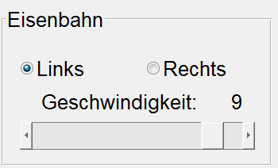

| Button| Function                                    |
|------|-------------------------------------------  |
|**Left**| Driving direction left  |
|**Right**| Driving direction right   |
|**Speed**| Train speed between 0 and 9| 

#### LEDs 

Because the room lighting is insufficient to ensure the proper functioning of the **QR-Code Webcam**. Here are some options that can be used to change the lighting conditions to support this camera. 
**NOTE: The LEDs have no effect on the multispectral camera (near-infrared) as they emit only visible light.**

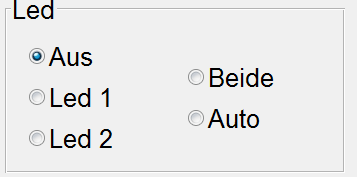

| Button| Function |
|------|-----------|
|**Led 1**| turn on Led 1  |
|**Led 2**| turn on Led 2  |
|**Beide**| turn on both of the LEDs |
|**Auto**| automatic activation of the LEDs| 
| **Aus**| turn off both of the LEDs  |

**Auto**:  In demo mode the LEDs are only turned on while  taking the picture of the QR-Code.

#### Halogen lamp

The **multispectral camera** needs special lighting conditions (infrared radiator) to function properly and deliver valuable usable images. Therefore, a **halogen lamp** was placed next to it. This lamp can be easily operated via the following interface.

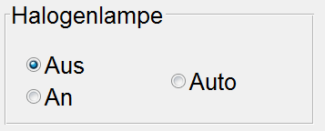

| Button| Function  |
|------|-----------|
| **Aus**| turn off the halogen lamp|
| **An**| turn on the halogen lamp|
| **Auto**| automatic activation of the halogen lamp|

**Auto**:  In demo mode the lamp will only turn on while the multispectral camera is taking the picture.

### Cameras

This system has four cameras:

#### Webcam QR-Code 

This camera is used to detect a QR code that is on a train carriage.

 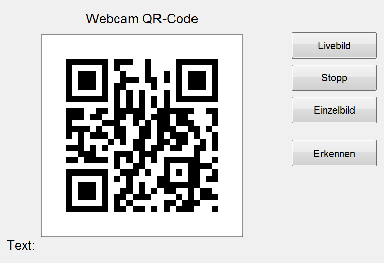

| Button      | Function                                                  |
| ---------- | --------------------------------------------------------- |
| **Livebild**   | turn on the camera and view the footage on the screen  |
| **Stopp**      | turn off the live image of the camera                                        |
| **Einzelbild** | take a picture and show it on the screen          |
| **Erkennen**   | Detect the QR-Code in the image and display a message on the screen. | 

When the QR-Code is detected, a green message appears next to the word **Text** as shown in the following figure.

 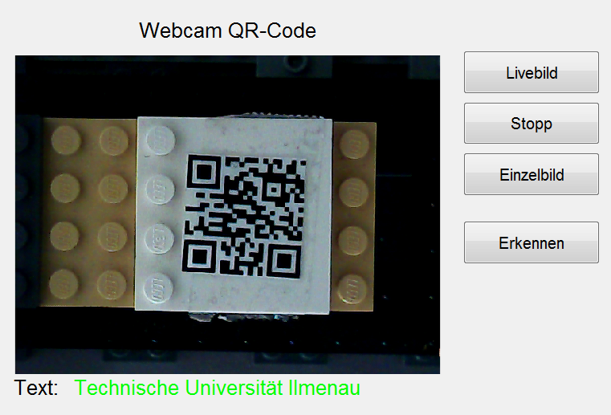

If the train is moving too fast, the QR-Code can not be detected. The message turns red and says **nothing recognized**.

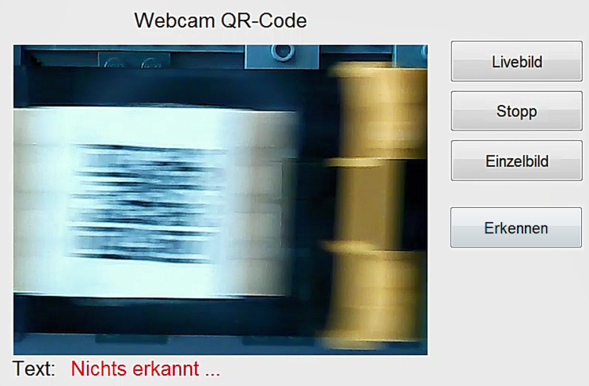

#### 3D via Laser line 

With the help of a laser line, the object, which is located on a train carriage, is scanned. After scanning, a 3D photo will be displayed on the screen, which can be rotated 360 degrees using the touchscreen.

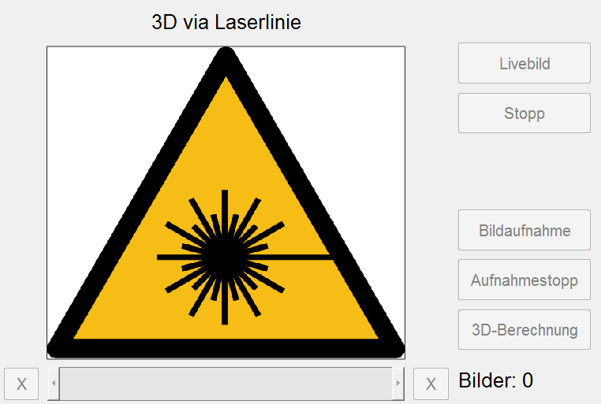

| Button      | Function                                                  |
| ---------- | --------------------------------------------------------- |
| **Livebild**   | turn on the camera and view the footage on the screen  |
| **Stopp**      | turn off the live image of the camera                                        |
| **Bildaufnahme** | start taking pictures        |
| **Aufnahmestopp**   | stop taking pictures |
| **3D-Berechnung**   | calculate the 3D-Picture |

Here is a picture showing the scanning process and the final displayed 3D-Picture.

Scanning             |  3D-Picture
:-------------------------:|:-------------------------:
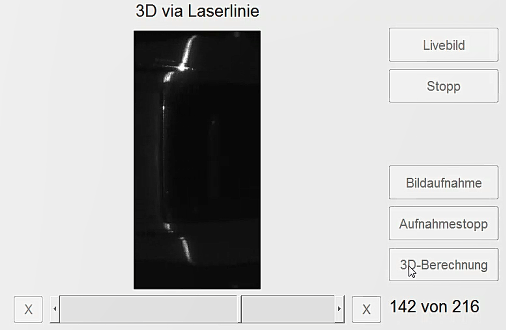  |  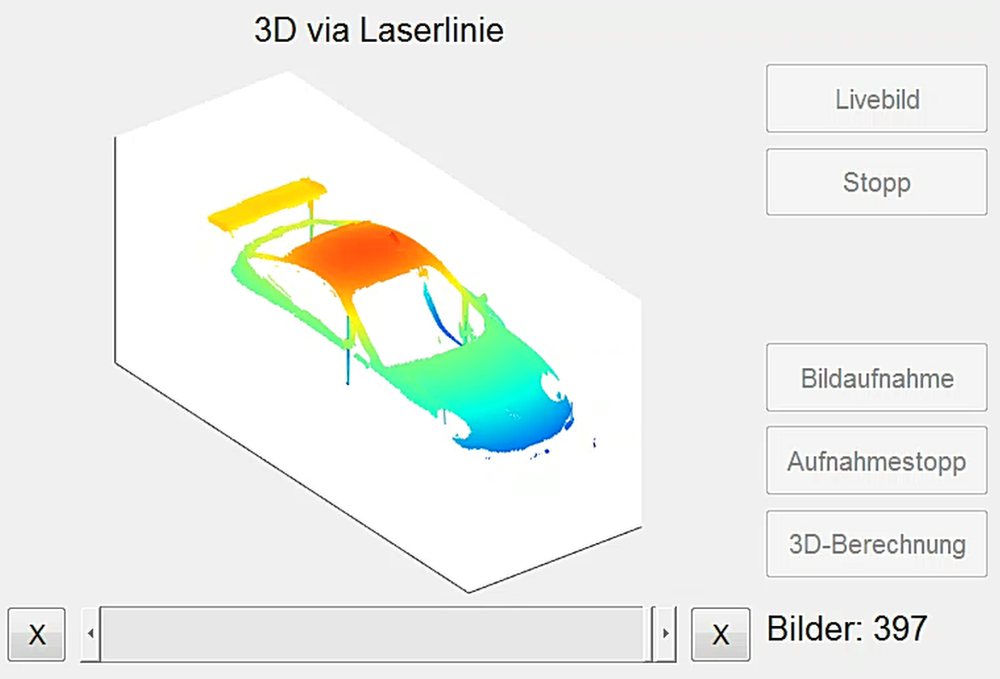

To manually start a 3D scan, these steps must be performed:
1. Click the button **Bildaufnahme**
2. Let the train pass through the light barrier at a constant speed
3. Click the button **Aufnahmestopp**
4. Click the button **3D-Berechnung**

If the recorded photos are insufficient to calculate a 3D model, an error message will be displayed on the screen.

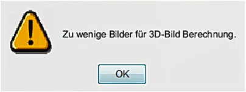

**Here is a preview to the work flow for the 3D-Laser Camera.** 

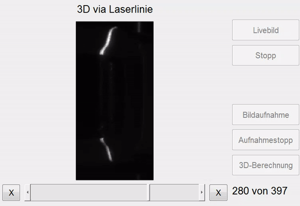

#### Multispectral

This camera uses the halogen lamp to take an infrared image that is in the near infrared range. 

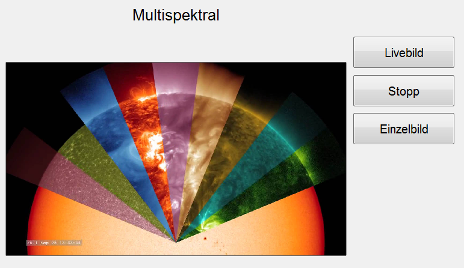

| Button      | Function                                                  |
| ---------- | --------------------------------------------------------- |
| **Livebild**   | turn on the camera and view the footage on the screen  |
| **Stopp**      | turn off the camera                                     |
| **Einzelbild** | take a picture and show it on the screen          |

Here are two pictures of a 100-euro bill, how it looks in normal light and how it looks with the multispectral camera:

Normal (RGB-Photo)             |  Multispectral (Near-Infrared-Photo)
:-------------------------:|:-------------------------:
  |  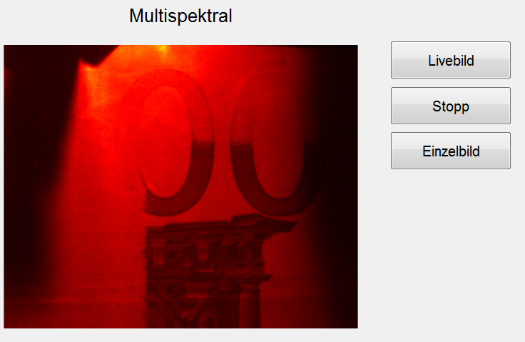

**NOTE: This camera needs a lot of light, so the halogen lamp must be on to see the object. The LEDs do not affect this camera because they emit only visible and no near infrared light.**

#### Infrared

The only function of this camera is to display a live image on the screen.

| Button      | Function                                                  |
| ---------- | --------------------------------------------------------- |
| **Livebild**   | turn on the camera and view the footage on the screen  |
| **Stopp**      | turn off the live image of the camera                                     |
| **Einzelbild** | take a picture and show it on the screen          |

Here is a live view of the infrared camera.

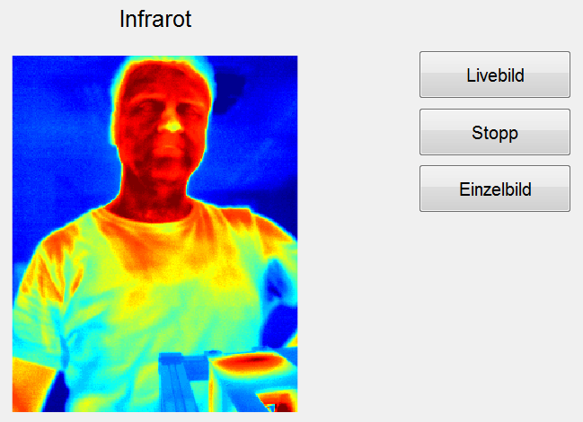

## Demo-Mode 
The main goal of **Demo Mode** is to carry out various measurement methods fully automatically, without the need for an operator. This mode is used at exhibitions and showrooms.

### Demo-Mode button

After the program has been initialized, as described in the section [**Programm Initialisieren**](https://gitlab.tu-ilmenau.de/FakMB/QBV/systems/legocity/legocity/blob/master/gui/doc/end-doc.md#programm-initialisieren), the demo mode key can be pressed. In demo mode, the train always travels on a circular path. In the first round, the train moves slowly as it reaches the station, allowing a black piece of plastic to move along a photocell, activating the laser line that scans the object on the train carriage (the car). In the second round, the train slows down when it reaches the station, the traffic light turns red, then the train stops so that the QR code (located on one of the carriages) will be positioned under the webcam and the second object(Euro-bill) will be under the multispectral camera, two photos will be taken in this round a QR-Code photo and a multispectral photo.

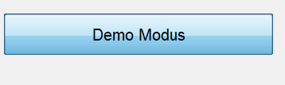

These steps are repeated until the Demo Mode button is pressed again.

If the  **Demo Modus** button is pressed before the **Kamerasinitialisieren** button, an **Error** message will be displayed on the screen.

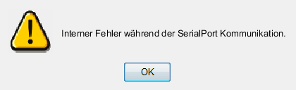