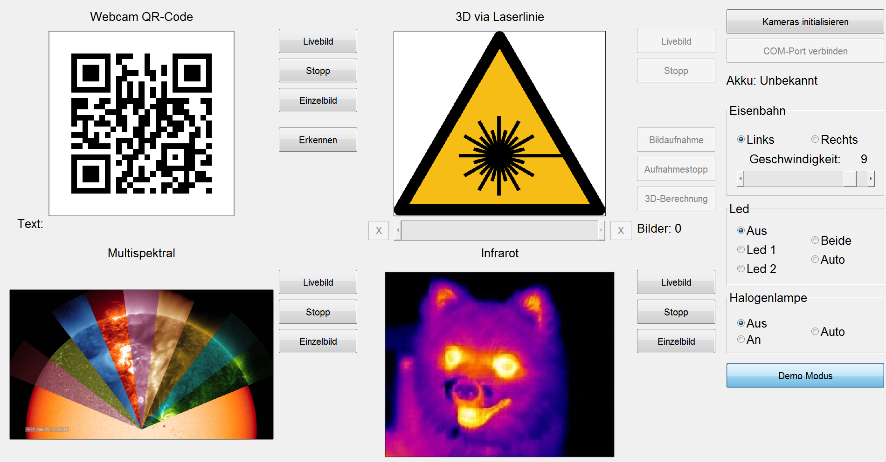

## Multi-Kamera-Demonstartor `Bedienoberfläche`
---
 

Hier in dieser Sektion wird die **Bedienoberfläche** des Projekts **Multi Kamera Demonstrator** dokumentiert und alle ihre Funktionen beschrieben.
Danach sollte sie in 4 Teile zerlegen und nochmal dokumentieren.

