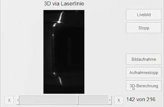

# End-User Document 

 
# **Demo-Mode** 
---
The main goal of **Demo Mode** is to test the components and the whole system (mainly to evaluate the work of the cameras) and to give a good overview of its functionality.

It is controlled with a program created by **Matlab-GUI**.
The interface consists mainly of two parts: the program initialization with the train test (speed and direction) -on the right side `1`-, and the manual part which controlls the cameras manually -on the left side `2`- (Fig 1).

[Fig1](images/oberflacheAktiv.PNG)  "User Interface"
---
## **Initialize the program** 
---
When the system is first turned on, it must be initialized for it to work properly. This process is performed as follows:
1. Pressing **COM-Port verbinden** to start the communication via the serial port, then the system takes a while untill the keys in `Part 1` are activated and ready for use. A small test can be made to ensure that the system is connected, for exaple: changing the speed of the train and checking if its going to move.
2. Pressing **Kameras initialisieren** and waiting for the cameras to connect ,the buttons in `Part 2` will be activated after a sucessful connection. The initialization of the cameras takes a very long time for the first time since they are activated one after the other.

After completing these two steps, the program is ready and can be started. The buttons mentioned above are located on the right side of the user interface (`Part 1`) (Fig 2).
 
 

[Fig2](images/kontro1.PNG) "Part 1"

If the  **Demo Modus** button is pressed before the **Kamerasinitialisieren** button, an `Error` message will be displayed on the screen (Fig 3).

 

[Fig3](images/demoFehler.PNG) "Error"

--- 
## **Control Part 1** 
### **Battery**
---

Shows the level of the battery in cV, for example: 779 that means 7.79 Volt.

[Fig 4](images/akku-connected.png) "Battery connected"

Before pressing the **COM-Port verbinden** button, the voltage of the battery will not be shown.

[Fig 5](images/akku-notconnected.png) "Battery not-connected"

### **Railway** 
--- 

This part helps to control the train `manually`, to determine the direction of travel either to the `left` or to the `right`, and to change the `speed` via a slider. But the program must be initialized first.

 

[Fig 6](images/Eisbahn.PNG) "Railway"

| Button| Function                                    |
|------|-------------------------------------------  |
|**Left**| Driving direction left  |
|**Right**| Driving direction right   |
|**Speed**| Train speed between 0 and 9| 

---
### **LEDs** 
---

Because the room lighting is insufficient to ensure the proper functioning of the cameras (except the infrared camera). Here are some options that can be used to change the lighting conditions to support the cameras.

[Fig 7](images/led.PNG) "LEDs"

| Button| Function |
|------|-----------|
|**Led 1**| turn on Led 1  |
|**Led 2**| turn on Led 2  |
|**Beide**| turn on both of the LEDs |
|**Auto**| automatic activation of the LEDs| 
| **Aus**| turn off both of the LEDs  |

`Auto`:  It automatically checks if more light is needed. It is then decided to switch on either Led1, Led2 or both of them, but only when the cart is in the correct position.

### **Halogen lamp** 
---

The **multispectral camera** needs special lighting conditions (infrared radiator) to function properly and deliver valuable usable images. Therefore, a **halogen lamp** was placed next to it. This lamp can be easily operated via the following interface.

 

[Fig 8](images/halogenlampe.PNG) "Halogen lamp"

| Button| Function  |
|------|-----------|
| **Aus**| turn off the halogen lamp|
| **An**| turn on the halogen lamp|
| **Auto**| automatic activation of the halogen lamp|

`Auto` :The camera will only turn on when the cart is in the correct position.

### **Demo-Mode button**
--- 

After the program has been initialized, as described in the section [**Programm Initialisieren**](https://gitlab.tu-ilmenau.de/FakMB/QBV/systems/legocity/legocity/blob/master/gui/doc/end-doc.md#programm-initialisieren), the demo mode key can be pressed. In demo mode, the train always travels on a circular path. In the first round, the QR code is scanned and recognized, and a multispectral photo will be taken. In the second round, the object on the wagon (the car) is scanned with a 3D laser scanner.

 

[Fig 8](images/demotaste.PNG) "Halogen lamp"

These steps are repeated until the Demo Mode button is pressed again.

# **Manual Mode**

In this Part the functions of the programm will be controlled manually but the system must be initialized before.

## **Cotrol Part 2**

### **Webcam QR-Code** 

This camera is used to detect a QR code that is on a train carriage.

  
 
[Fig 9](images/QR1.PNG) "Webcam QR-Code"
"

| Button      | Function                                                  |
| ---------- | --------------------------------------------------------- |
| **Livebild**   | turn on the camera and view the footage on the screen  |
| **Stopp**      | turn off the camera                                        |
| **Einzelbild** | take a picture and show it on the screen          |
| **Erkennen**   | Detect the QR-Code in the image and display a message on the screen. | 

When the train reaches the station, it moves slowly and then stops, so that the QR-Code is positioned directly under the webcam to be recognized. When the QR-Code is detected, a green message appears next to the word `Text` as shown in (Fig 10).

  
 
[Fig 10](images/QRerkennen.PNG) "QR-Code detected"

If the train is moving too fast, the QR-Code can not be detected. The message turns red and says `nothing recognized` (Fig 11).

 
 
[Fig 11](images/notdetected.PNG) "QR-Code not recognized"

---

## **3D via Laser line** 

With the help of a laser line, the object, which is located on a train carriage, is scanned. After scanning, a 3D photo will be displayed on the screen, which can be rotated 360 degrees using the touchscreen.

 

[Fig 12](images/3d.png) "3D via Laser line"

| Button      | Function                                                  |
| ---------- | --------------------------------------------------------- |
| **Livebild**   | turn on the camera and view the footage on the screen  |
| **Stopp**      | turn off the camera                                        |
| **Bildaufnahme** | start taking pictures        |
| **Aufnahmestopp**   | stop taking pictures |
| **3D-Berechnung**   | calculate the 3D-Picture |

Here is a picture showing the scanning process and the final displayed 3D-Picture.

Scanning             |  3D-Picture
:-------------------------:|:-------------------------:
  |  
[Fig 13](images/scanning3d2.PNG) "Scanning process"

If the recorded photos are insufficient to calculate a 3D model, an error message will be displayed on the screen.

   

Here is a full preview to the work flow for the 3D-Laser Camera.  

[Fig 14](images/Error3D.PNG) "3D Error"

## **Multispectral**

This camera uses the halogen lamp to take an infrared image that is in the near infrared range.

 

[Fig 15](images/Multispektral.PNG) "Multispectral"

| Button      | Function                                                  |
| ---------- | --------------------------------------------------------- |
| **Livebild**   | turn on the camera and view the footage on the screen  |
| **Stopp**      | turn off the camera                                     |
| **Einzelbild** | take a picture and show it on the screen          |

## **Infrared**

The only function of this camera is to display a live image on the screen.

 

[Fig 16](images/Infrarot.PNG) "Infrared"

| Button      | Function                                                  |
| ---------- | --------------------------------------------------------- |
| **Livebild**   | turn on the camera and view the footage on the screen  |
| **Stopp**      | turn off the camera                                     |
| **Einzelbild** | take a picture and show it on the screen          |

