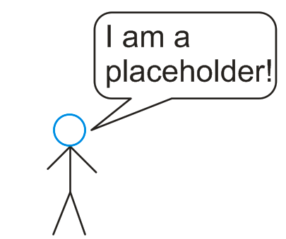

# End-User Document  

  

## **Demo-Modus**  

---

Das hapute Ziel des **Demomodus** ist, das ganze System und alle Komponenten zu testen und einen guten Überblick über seine Funktionalität zu geben.  
Das Modus wird von einem durch **Matlab-GUI und AppDesigner** erstellten Prdogramm gesteurt.  
Das Programm besteht hauptsichlich aus 2 Teilen, Dem Programm-Initialisition und Zugkontrol Teil `1` am rechten Seite und dem Kameras Kontrol Teil `2` Abb (1).

<!--  -->  

---

## **Programm Initialisieren**  

---
1. **Com-Port verbinden** Taste drücken und warten darauf, bis die Tasten im Teil 1 aktiviert werden.
2. **Kameras initialisieren** Taste drücken und warten darauf, bis die Tasten im Teil 2 aktiviert werden.  

jetzt ist das Programmm bereit und man kann es benutzen. Die beiden Tasten befinden sich in der obern rechten Seite der Bedienoberfäche *(Teil 1)* Abb (2).
<!--
Das Programm muss initialisiert werden, indem man erst die **COM-Port verbinden** Taste drückt. Dann wird die **Demo Modus** Taste aktiviert. danach muss die **Kameras initialisieren** Taste gedrückt werden. Die beiden Tasten befinden sich in der oberern rechten Seite von der Bedienoberfläche *(Teil 1)* Abb (2). Es dauert ungefähr 10 Sekunden, bevor das System bereit ist.  
-->

<!--    -->  

  

Wenn man die **Demo Modus** Taste bevor **Kamerasinitialisieren** Taste drückt, bekommt er einen `Fehler` Abb (3).

  

---  

## **Programmbedienung**  

### **Akku**

---

### **Eisenbahn**  

---  

<!--    -->
    

Damit hat man die Möglichkeit den Zug `manuell` zu fahren und die Richtung des Fahrens etnweder **links** oder **rechts** mit der **Geschwindigkeit**, die durch einen Schieber bestimmt werden kann, auszuwählen.  
Das programm muss **bevor** diesem Verfahren initialisiert werden.  

| Taste| Funktion                                    |
|------|-------------------------------------------  |
| **Links**| Bewegungsrichtung nach Links auswählen  |
|**Rchts**| Bewegungsrichtung nach Rechts auswälen   |
|**Geschwindigkeit**| Zugsgeschwindigkeit von  0 -- 9|  

### **Led**  

---
  

Manchmal ist die Beleuchtung von der Umgebung nicht genug, um die Kameras richtig arbeiten können. Die optionen, mit denen man festlegt, wie stark die Beleuchtung ist, können ebenfalls hier gefunden werden.  

| Taste| Funktion  |
|------|-----------|
| **Led 1**| Led 1 anschalten  `von Anfang`|
| **Led 2**| Led 2 anschalten  `von Anfang`|
|**Beide**| Led 1 und Led 2 zusammen anschalten   `von Anfang`|
|**Auto**| Es wird automatisch geprüft ob mehr Licht gebraucht ist ggf. Led 1 oder 2 oder die beiden anshcalten, `aber nur` wenn der Wagen in der richtigen Position ist |  
| **Aus**| die beiden Leds ausschalten  |

### **Halogenlampe**  

---
Die **Multispektralkamera** setzt spezielle *Lichtbedingungen* voraus, damit sie richtig funktioniert und wertvolle nutzbare Bilder gewährleistet. Deswegen wurde eine **Halogenlampe** am Projekt hinzugefügt. Diese Lampe konnte einfach durch die folgenden Fläche bedient werden.  
Im Auto :`Die Kamera wird nur eingeschaltet, wenn der Wagen in der richtigen Position ist`

  

| Taste| Funktion  |
|------|-----------|
| **Aus**| Lampe ausschalten `von Anfang`|
| **An**| Lampe anschalten `von Anfang`|
| **Auto**| Lampe wird automatisch ein- oder ausgeschaltet|

### **Demo Modus Taste**

---  
  

Nachdem das Programm initialisiert wurde -wie im Abschnitt [**Programm Initialisieren**](https://gitlab.tu-ilmenau.de/FakMB/QBV/systems/legocity/legocity/blob/master/gui/doc/end-doc.md#programm-initialisieren)-, kann man die **Demo Modus** Taste drücken.  

Im Demo Modus fährt der Zug immer wieder im Kreisbahn. In der erste Runde wird die **QR-Code** gescannt und erkennt. Dann in der Nächsten wird ein Objekt durch **3D-Laserscanner** gescannt. Dannch wird ein **multispektral** Foto aufgenommen. Alles wiederholt sich immer wieder, bis die **Demo Modus** Taste wieder gedrückt wird.  

## **QR-Code Kamera**  

  
<!--    -->

Diese Kamera dient zur Erkennung eines QR-Codes, das sich auf einem Wagen befindet.

| Taste      | Funktion                                                  |
| ---------- | --------------------------------------------------------- |
| **Livebild**   | die Kamera zeigt die Bildkomposition über den Bildschirm  |
| **Stopp**      | Kamera Ausschalten                                        |
| **Einzelbild** | ein Foto aufnehmen und auf dem Bildschirm zeigen          |
| **Erkennen**   | QR-Code im Bild erkenen und In der Textuelle unten Zeigen |  

  
<!--    -->

---
