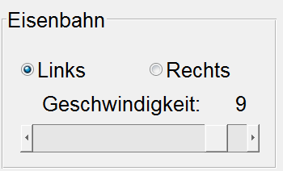

# End-User Document  

  

## **Demo-Modus**  

---

Das hapute Ziel des **Demomodus** ist, das ganze System und alle Komponenten zu testen und einen guten Überblick über seine Funktionalität zu geben.  
Das Modus wird von einem durch **Matlab-GUI und AppDesigner** erstellten Prdogramm gesteurt.  
Das Programm besteht hauptsichlich aus 2 Teilen, Dem Programm-Initialisition und Zugkontrol Teil `1` am rechten Seite und dem Kameras Kontrol Teil `2` Abb (1).

<!--  -->  

---

## **Programm Initialisieren**  

---
1. **Com-Port verbinden** Taste drücken und warten darauf, bis die Tasten im Teil 1 aktiviert werden.
2. **Kameras initialisieren** Taste drücken und warten darauf, bis die Tasten im Teil 2 aktiviert werden.  

Jetzt ist das Programmm bereit und man kann es benutzen. Die beiden Tasten befinden sich in der obern rechten Seite der Bedienoberfäche *(Teil 1)* Abb (2).
<!--
Das Programm muss initialisiert werden, indem man erst die **COM-Port verbinden** Taste drückt. Dann wird die **Demo Modus** Taste aktiviert. danach muss die **Kameras initialisieren** Taste gedrückt werden. Die beiden Tasten befinden sich in der oberern rechten Seite von der Bedienoberfläche *(Teil 1)* Abb (2). Es dauert ungefähr 10 Sekunden, bevor das System bereit ist.  
-->

<!--    -->  

  

Wenn man die **Demo Modus** Taste bevor **Kamerasinitialisieren** Taste drückt, bekommt er einen `Fehler` Abb (3).

  

---  

## **Steuerteil 1** 
### **Akku**

---
Zeigt die Batteriespannung in cV an, z.B.: 779 bedeutet 7,79 Volt.

Vor dem Drücken der Taste **COM-Port verbinden** wird die Batteriespannung nicht angezeigt.

### **Eisenbahn**  

---  

<!--    -->
    

Damit hat man die Möglichkeit den Zug `manuell` zu fahren und die Richtung des Fahrens etnweder **links** oder **rechts** mit der **Geschwindigkeit**, die durch einen Schieber bestimmt werden kann, auszuwählen.  
Das programm muss **bevor** diesem Verfahren initialisiert werden.  

| Taste| Funktion                                    |
|------|-------------------------------------------  |
| **Links**| Bewegungsrichtung nach Links auswählen  |
|**Rchts**| Bewegungsrichtung nach Rechts auswälen   |
|**Geschwindigkeit**| Zugsgeschwindigkeit von  0 -- 9|  

### **Led**  

---
  

Manchmal ist die Beleuchtung von der Umgebung nicht genug, um die Kameras richtig arbeiten können. Die optionen, mit denen man festlegt, wie stark die Beleuchtung ist, können ebenfalls hier gefunden werden.  

| Taste| Funktion  |
|------|-----------|
| **Led 1**| Led 1 anschalten  `von Anfang`|
| **Led 2**| Led 2 anschalten  `von Anfang`|
|**Beide**| Led 1 und Led 2 zusammen anschalten   `von Anfang`|
|**Auto**| Es wird automatisch geprüft ob mehr Licht gebraucht ist ggf. Led 1 oder 2 oder die beiden anshcalten, `aber nur` wenn der Wagen in der richtigen Position ist |  
| **Aus**| die beiden Leds ausschalten  |

### **Halogenlampe**  

---
Die **Multispektralkamera** setzt spezielle *Lichtbedingungen* voraus, damit sie richtig funktioniert und wertvolle nutzbare Bilder gewährleistet. Deswegen wurde eine **Halogenlampe** am Projekt hinzugefügt. Diese Lampe konnte einfach durch die folgenden Fläche bedient werden.  
Im Auto :`Die Kamera wird nur eingeschaltet, wenn der Wagen in der richtigen Position ist`

  

| Taste| Funktion  |
|------|-----------|
| **Aus**| Lampe ausschalten `von Anfang`|
| **An**| Lampe anschalten `von Anfang`|
| **Auto**| Lampe wird automatisch ein- oder ausgeschaltet|

### **Demo Modus Taste**

---  
  

Nachdem das Programm initialisiert wurde -wie im Abschnitt [**Programm Initialisieren**](https://gitlab.tu-ilmenau.de/FakMB/QBV/systems/legocity/legocity/blob/master/gui/doc/end-doc.md#programm-initialisieren)-, kann man die **Demo Modus** Taste drücken.  

Im Demo Modus fährt der Zug immer wieder im Kreisbahn. In der erste Runde wird die **QR-Code** gescannt und erkennt. Dann in der Nächsten wird ein Objekt durch **3D-Laserscanner** gescannt. Dannch wird ein **multispektral** Foto aufgenommen. Alles wiederholt sich immer wieder, bis die **Demo Modus** Taste wieder gedrückt wird.  

# **Manuell-Modus**

In diesem Teil werden die Funktionen des Programms manuell gesteuert, das System muss jedoch zuvor initialisiert werden.

## **Steuerteil 2**

### **Webcam QR-Code** 

Diese Kamera wird verwendet, um einen QR-Code zu erkennen, der sich in einem Zugwagen befindet.

  
 
[Abb 9](images/QR1.PNG) "Webcam QR-Code"
"

| Taste      | Funktion                                                  |
| ---------- | --------------------------------------------------------- |
| **Livebild**   | Kamera einschalten und das Filmmaterial auf dem Bildschirm anzeigen  |
| **Stopp**      | Kamera ausschalten                                       |
| **Einzelbild** | Bild aufnehmen und auf dem Bildschirm anzeigen          |
| **Erkennen**   | Erkennen des QR-Codes im Bild und Anzeigen einer Meldung auf dem Bildschirm | 

Wenn der Zug den Bahnhof erreicht, fährt er langsam und hält dann an, so dass der QR-Code direkt unter der zu erkennenden Webcam positioniert wird. Wenn der QR-Code erkannt wird, wird neben dem Wort Text eine grüne Meldung angezeigt (siehe Abbildung 10)

  
 
[Abb 10](images/QRerkennen.PNG) "QR-Code erkannt"

Wenn der Zug zu schnell fährt, wird der QR-Code nicht erkannt. Die Meldung wird rot und zeigt `Nichts erkannt` an (Abbildung 11).

 
 
[Abb 11](images/notdetected.PNG) "QR-Code nicht erkannt"

---

## **3D via Laserlinie** 

Mit Hilfe einer Laserlinie wird das Objekt, das sich auf einem Zugwagen befindet, gescannt. Nach dem Scannen wird ein 3D-Foto auf dem Bildschirm angezeigt, das über den Touchscreen um 360 Grad gedreht werden kann.

 

[Abb 12](images/3d.PNG) "3D via Laserlinie"

| Taste      | Funktion                                                  |
| ---------- | --------------------------------------------------------- |
| **Livebild**   | Kamera einschalten und das Filmmaterial auf dem Bildschirm anzeigen  |
| **Stopp**      | Kamera ausschalten                                        |
| **Bildaufnahme** | Bilder aufnehmen        |
| **Aufnahmestopp**   | der Aufnahmeprozess beenden |
| **3D-Berechnung**   | Berechnung der aufgenommenen Bilder in einem 3D-Bild |

Hier ist ein Bild, das den Scan und das endgültige 3D-Bild zeigt.

Scannen             |  3D-Bild
:-------------------------:|:-------------------------:
  |  
[Abb 13](images/scanning3d2.PNG) "Scanprozess"

**Hier ist eine vollständige Vorschau des Arbeitsablaufs für die 3D-Laserkamera** 

Wenn die aufgenommenen Bilder nicht ausreichen, um ein 3D-Modell zu berechnen, wird eine Fehlermeldung auf dem Bildschirm angezeigt.

 

[Abb 14](images/Error3d.PNG) "3D Fehler"

## **Multispectral**

Diese Kamera verwendet die Halogenlampe, um ein Infrarotbild im nahen Infrarotbereich aufzunehmen.

 

[Abb 15](images/Multispektral.PNG) "Multispektral"

| Taste      | Funktion                                                  |
| ---------- | --------------------------------------------------------- |
| **Livebild**   | Kamera einschalten und das Filmmaterial auf dem Bildschirm anzeigen  |
| **Stopp**      | Kamera ausschalten                                     |
| **Einzelbild** | Bild aufnehmen und auf dem Bildschirm anzeigen          |

## **Infrared**

Die einzige Funktion dieser Kamera ist, ein Livebild auf dem Bildschirm anzuzeigen.

 

[Abb 16](images/Infrarot.PNG) "Infrarot"

| Taste      | Funktion                                                  |
| ---------- | --------------------------------------------------------- |
| **Livebild**   | Kamera einschalten und das Filmmaterial auf dem Bildschirm anzeigen  |
| **Stopp**      | Kamera ausschalten                                     |
| **Einzelbild** | Bild aufnehmen und auf dem Bildschirm anzeigen          |